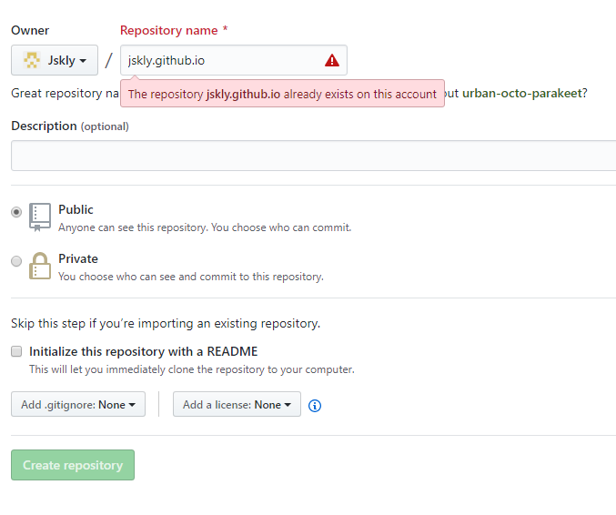

## 前言
老哥我之前的博客系统是基于~~WordPress~~, 一开始用的是阿里的服务器搭的， 后来觉得服务器维护起来实在太麻烦，再者每个月的服务器费用平时工作太忙也没有好好使用，就感觉很浪费钱(虽然只要50块，但是50块买炸鸡不香吗)。后来就买了一个虚拟空间放博客。后来什么原因又要重新备案，而且虚拟空间有限， 放图片也是个问题呢，真是不想折腾。
虽然不怎么折腾博客， 但是日常的笔记一直在写，用的是**有道云笔记**。不过有道的只支持基本的**Markdown**，真是很遗憾 。
我想既然这样为啥不搭一个静态博客呢，还能在网上访问到，你说是吧。如果你也和我一样，那么 hexo 也适合你， 本文章会教你基于**gitPage**和**hexo**搭建免费的个人博客。闲话少叙，砸们开始吧。
你可以访问[**Hexo官网**](https://hexo.io/) 查看介绍     [**Hexo文档**](https://hexo.io/docs/)  [**GitHub仓库地址**](https://github.com/hexojs/hexo/issues).
## 预备
1. 我已默认你已经注册了 [**GayHub**](https://github.com). 没有的大胸弟自行点击注册哦。:v:
2. 如果你没有安装 [**nodejs**](http://nodejs.cn/) 和 [**Git**](https://git-scm.com/) 的话 请先自行安装。
## 安装hexo
1. 运行命令
```bash
npm i -g hexo
hexo -v //查看版本
```
2. 找一个合适的空间建立博客根目录
```bash
mkdir blog 
```
3. 进入目录并初始化博客
```bash
cd blog
hexo init //初始化
```
3. 本地运行hexo看是否成功了,如果运行成功系统会提示你在浏览器打开 [http://localhost:4000](http://localhost:4000)
```bash
hexo g  //生成静态页面
hexo s  //运行本地服务器
```

## 配置GitPage
注意由于Github网页改版操作可能有些不同
1. 首先登陆GitHub新建一个代码仓库。(仓库名是你的用户名 + github.io)

3. 点击**setting**, 往下拉到 **GitHub Pages** 你可以看到, 根据提示我们首先添加一些内容到这个仓库，我们把之前可以之前搭建的发布到这个仓库

4. 安装Git的插件
```bash
npm install --save hexo-deployer-git
```
5. 用编辑器打开博客目录，配置 **_config.yml** 找到 **deploy** 并修改
```yml
deploy:
  type: git
  repo: 
    github: https://github.com/Jskly/jskly.github.io  #注意改成你自己的
    branch: master
```
6. 部署
```
hexo clean //清缓存
hexo g 
hexo d //发布，这时候如果你没有配置ssh的话就需要输入账号和密码
```
7. 浏览器输入 `jskly.github.io` 就能访问倒你的博客啦
8. 有时候发布到GitPage的不是master分支(可能和你的github用户名有关)，这时候你可以查看仓库**Setting**下的**gitpage**选项做出相应的配置。
9. 当然这还远远不够，你还需要配置你的站点信息 我在这里就不一一介绍了 你可以查看[**文档**](https://hexo.io/zh-cn/docs/configuration)来配置你的博客

## 引入本地图片
如果不用图床或者网络图片现在我们的站点是还不能显示图片的。这就要做以下配置
so easy👌只需短短2步:
1. 配置博客目录下的 _config.yml 文件查找 **post_asset_folder** 并把它改成**true**, 这样在你建立文件时，Hexo会自动建立一个与文章同名的文件夹
2. 在博客根目录执行以下命令安装插件
```
  npm install hexo-asset-image --save // 介系一个阔以上传本地图片的插件
```
尝试以下看成功了没:
1. 依次运行命令`hexo n mysql删库到跑路` 试试看吧, 如果一切妥当， 那么在 `source/_post` 目录之下除了 **mysql删库到跑路.md** 的文件外还有一个同名的文件夹
2. 在该文件夹下随便放一张你的帅照 **ShuaiZhao.jpg** , 然后在**mysql删库到跑路.md**文件中引入:
```
  
```
3. 运行`hexo clean ` , `hexo g`,`hexo s` 瞅瞅。看成功没。 没能成功？ 快去搜索一下插件兼容是不是有问题。我反正是阔以的。   
4. 没成功也没关系哈, 你也可以在图窗或者云空间上放置图片， 在文章里`` 即可。


## 最后来给你的博客加点欢乐的元素————开启emoji之旅 😍🤣

1. 安装
命令如下
```bash
npm un hexo-renderer-marked --save
npm i hexo-renderer-markdown-it --save
npm install markdown-it-emoji --save
```
2. 配置
修改 Hexo 站点配置文件 _config.yml 文件添加如下代码

```yml
## markdown 渲染引擎配置，默认是hexo-renderer-marked，这个插件渲染速度更快，且有新特性
markdown:
  render:
    html: true
    xhtmlOut: false
    breaks: true
    linkify: true
    typographer: true
    quotes: '“”‘’'
  plugins:
    - markdown-it-footnote
    - markdown-it-sup
    - markdown-it-sub
    - markdown-it-abbr
    - markdown-it-emoji
  anchors:
    level: 2
    collisionSuffix: 'v'
    permalink: true
    permalinkClass: header-anchor
```

## 完

